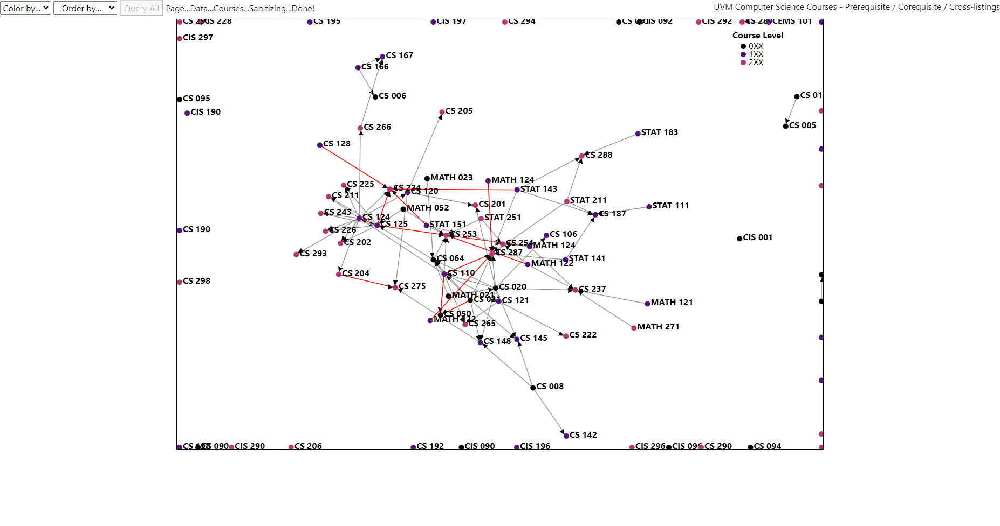
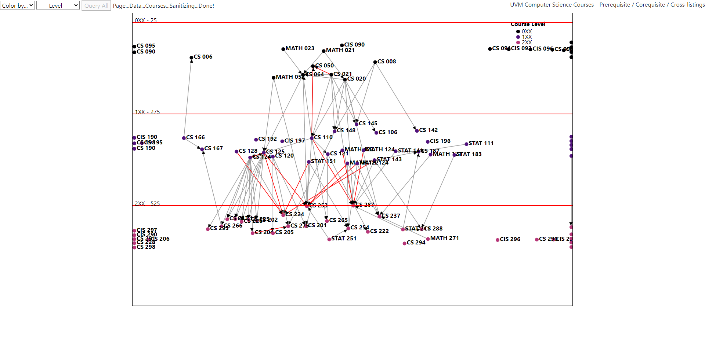

# Vizualization of UVM Computer Science Courses

https://www.uvm.edu/cems/cs/courses

The UVM computer science department hosts a variety of courses, linked together by pre-requisite and co-requisite requirements. While the graph above gives a helpful overview,
it feels somewhat difficult to read through.

This is an interactive D3.js force directed graph that scrapes the above page, parses all class names, and develops links based on requirements for a course.

## Examples

